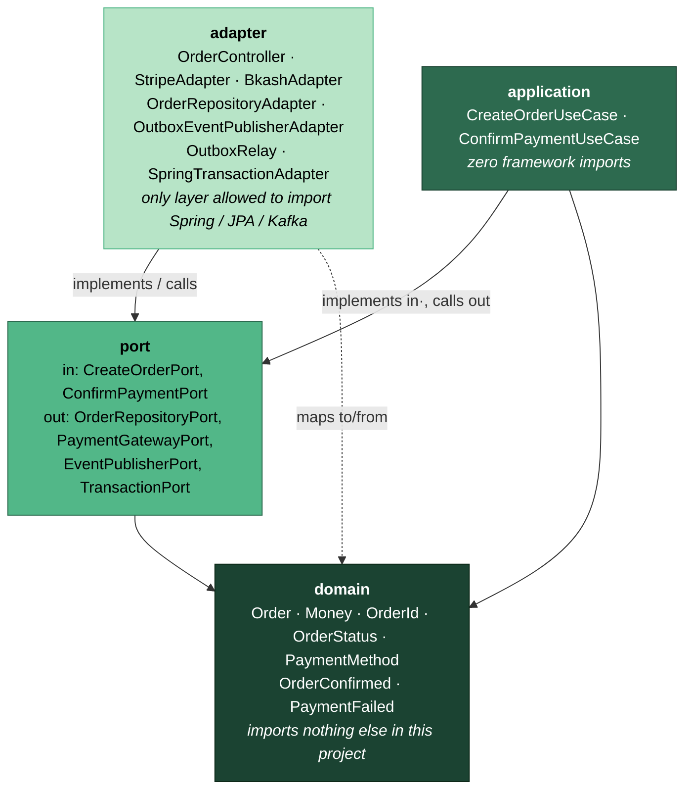
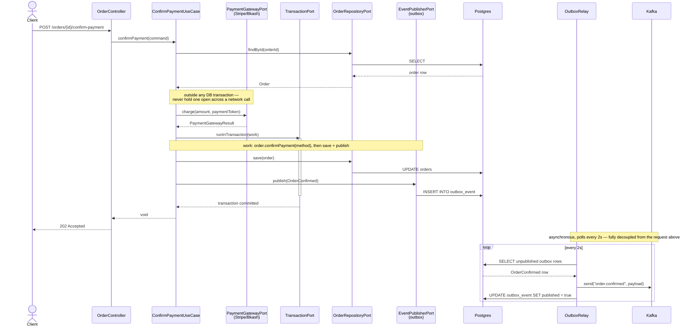

# miniddd — Payment Order Service

A reference Spring Boot microservice demonstrating **Hexagonal Architecture**, **Clean Architecture's
dependency rule**, and **DDD tactical patterns** working together, end to end, in one small codebase.

## The story

A customer places an order, then confirms payment through one of three gateways — **Stripe**, **bKash**, or
**Nagad**. Regardless of which gateway is used, a successful payment always produces the same domain event
(`OrderConfirmed`), published through a transactional outbox to Kafka, so downstream consumers never need to
know which gateway was involved.

## Architecture

```
domain/          Order aggregate, Money/OrderId value objects, OrderStatus/PaymentMethod enums, domain events.
                 No Spring, no JPA, no adapter imports — plain Java only.

application/     CreateOrderUseCase, ConfirmPaymentUseCase. Depend only on ports, never on adapters.
                 Also framework-free (including no @Transactional — see below).

port/            Interfaces only.
  in/              Called by adapters, implemented by use cases (CreateOrderPort, ConfirmPaymentPort).
  out/             Called by use cases, implemented by adapters (OrderRepositoryPort, PaymentGatewayPort,
                   EventPublisherPort, TransactionPort).

adapter/         The only layer allowed to import Spring, JPA, or Kafka.
  in/web/          REST controller.
  out/payment/     StripeAdapter, BkashAdapter.
  out/persistence/ Postgres-backed OrderRepositoryPort implementation.
  out/messaging/   Transactional outbox writer + Kafka relay.
  out/transaction/ Spring transaction management, exposed to the application layer as a plain port.

config/          Composition root — the only place use cases are wired up as Spring beans.
```

Dependencies only point inward: `adapter` → `port` + `domain`, `application` → `port` + `domain`, `port` →
`domain`, `domain` → nothing. See [CLAUDE.md](CLAUDE.md) for the reasoning behind the two non-obvious design
choices (`TransactionPort` and the transactional outbox).

### Dependency graph



Solid arrows are "depends on / imports"; the dashed arrow is adapters mapping their own DTOs and JPA entities
to/from domain types (allowed — it's still pointing inward). No arrow ever points from a lower box to a
higher one.

### Confirm-payment flow (transactional outbox)

The part of this codebase most likely to surprise someone who's only seen `@Transactional` on a Spring
service: the DB write and the Kafka publish are deliberately *not* in the same step.



Why the gateway call sits outside `runInTransaction`: an HTTP call to an external payment gateway can be slow
or hang, and a database transaction should never be held open for the duration of a network call it doesn't
control. Why the Kafka send isn't inline either: it decouples "the order is durably confirmed" from "Kafka
happened to be reachable at that instant" — the outbox row is the source of truth, `OutboxRelay` just retries
until it succeeds.

## Getting started

Requires JDK 25 (point `JAVA_HOME` at it if it's not your default JDK). Maven is not required to be installed
— use the included wrapper.

```
./mvnw test        # run the domain test suite (no Spring context needed)
./mvnw package      # build the jar
```

Running the app (`./mvnw spring-boot:run`) additionally requires Postgres and Kafka. The easiest way:

```
docker compose up -d
```

This starts Postgres on `localhost:5432` (database `miniddd`, user/password `miniddd`/`miniddd`, auto-created
on first boot) and Kafka on `localhost:29092`, matching `application.yml`'s defaults exactly — no manual setup
needed. `docker compose down` stops them; add `-v` to also drop the data volumes.

All four values are overridable via the `DB_URL`, `DB_USERNAME`, `DB_PASSWORD`, or `KAFKA_BOOTSTRAP_SERVERS`
environment variables without touching `application.yml` or `docker-compose.yml` — useful if you're running
this against a different Postgres/Kafka (e.g. a shared infra stack you already have up) instead of the bundled
compose file. In that case, watch for the same two gotchas any Postgres/Kafka pairing has: the target database
and role need to actually exist (the bundled compose creates them for you via `POSTGRES_DB`/`POSTGRES_USER`
env vars; a shared instance might not), and if Kafka exposes separate internal/external listeners, make sure
the bootstrap address you point at is the one advertised for host access, not the Docker-internal one.

## API

**Create an order**

```
POST /api/orders
{
  "customerId": "b3b2c1a0-0000-0000-0000-000000000001",
  "amount": 49.99,
  "currency": "USD"
}
```
→ `201 Created` with `{ "orderId": "..." }`

**Get an order**

```
GET /api/orders/{orderId}
```
→ `200 OK` with `{ "orderId", "customerId", "amount", "currency", "status", "paymentMethod" }`, or `404` if it
doesn't exist.

**Confirm payment**

```
POST /api/orders/{orderId}/confirm-payment
{
  "paymentMethod": "STRIPE",
  "paymentToken": "tok_example"
}
```
→ `202 Accepted`. Confirmation involves a call to an external gateway, so the response doesn't carry a
synchronous success/failure verdict — poll `GET /api/orders/{orderId}` afterward, or consume the
`order.confirmed` / `order.payment-failed` Kafka topics.
